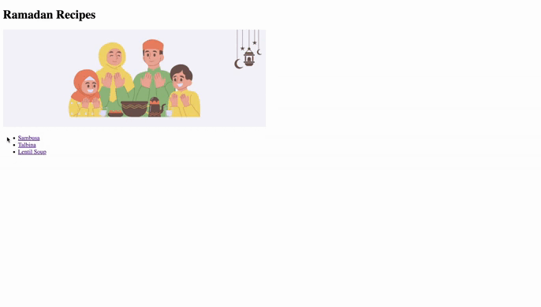

# Ramadan Recipes

Ramadan Recipes website is my first project created to follow  [The Odin Project](https://www.theodinproject.com/lessons/foundations-recipes) (Recipes project) from the foundations course. 

The purpose of Ramadan Recipes is to practice all of the HTML knowledge and setting up a GitHub Repository and to become familiar with Git basics. 

And lastly, to practice the process of writing a commit.

## Tech

The website was built with only HTML and no CSS. It consists of a main index page with recipes linked to it.  

## Demo

## Acknowledgements

 - [The Odin Project](https://www.theodinproject.com/lessons/foundations-recipes)
 - [How to commit and push your changes to your GitHub repository in VScode](https://zeroesandones.medium.com/how-to-commit-and-push-your-changes-to-your-github-repository-in-vscode-77a7a3d7dd02)
 - [How to fix image not showing in an HTML page](https://sebhastian.com/html-image-not-showing/)